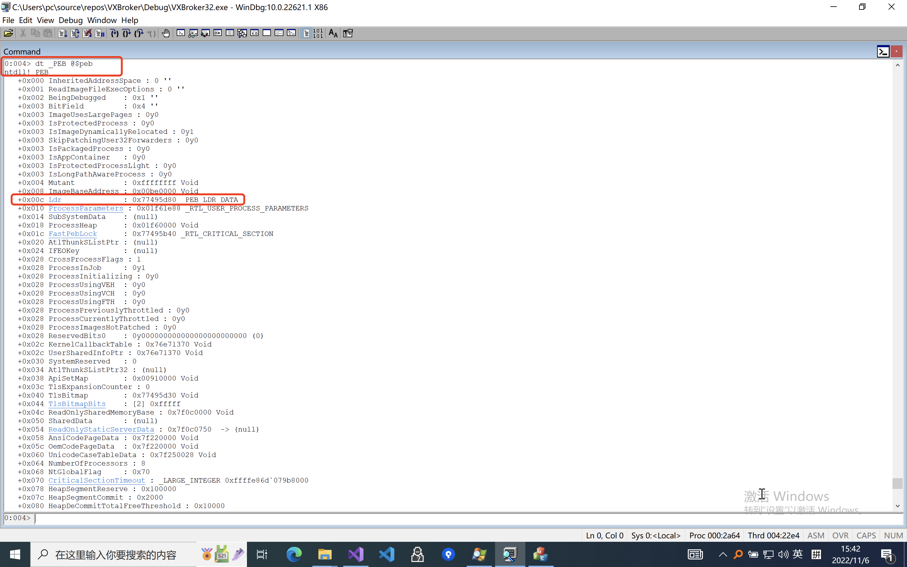

# Inject Dll by SetThreadContext

## Debugging in WinDBG

```bash
dt _PEB @$peb
```


## Reference

[1] [windbg学习23（!peb和PEB结构）](http://t.zoukankan.com/hgy413-p-3693439.html)

[2] [枚举windows进程模块的几种方法—PEB内核结构详解](https://blog.csdn.net/kongguoqing791025/article/details/121408205)